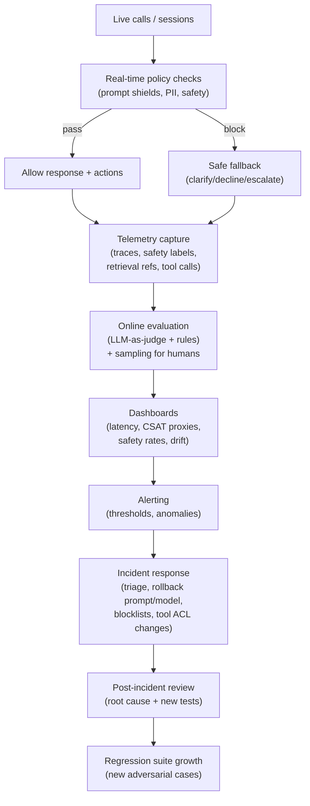
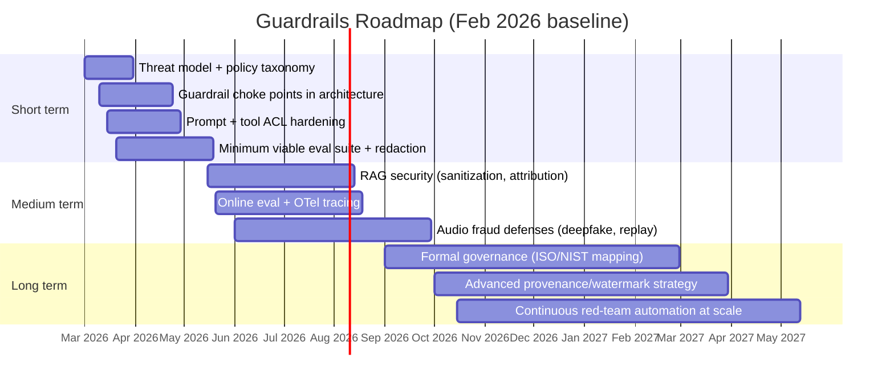

# State of the Art AI Guardrails for Customer-Support Voice Agents

## Executive summary

Voice agents for customer support combine safety-critical behaviors (identity verification, payments, refunds, cancellations) with a high-risk input channel (untrusted audio) and high-consequence outputs (spoken, persuasive, sometimes “human-sounding”). The state of the art in Feb 2026 is best understood as **defense-in-depth across four layers**: (1) telephony / audio ingestion, (2) ASR + dialog state, (3) LLM orchestration + tools + retrieval, and (4) output rendering (TTS / speech-to-speech) plus monitoring. This layering is broadly consistent across modern voice-agent architectures described by industry guides and major platform documentation. citeturn5view1turn17view0turn9search10

The strongest commercially available “guardrails” have converged into **productized safety control planes** and **agent-scaffolding patterns**:
- **Input/output safety screening** (harm categories, jailbreak/prompt-attack detection, denied topics, sensitive-info filters) is now offered as configurable services by major cloud providers. citeturn9search0turn9search4turn9search1turn10search0turn10search24  
- **Groundedness / hallucination controls** moved from academic prototypes into practical, vendor-exposed features (groundedness detection and “contextual grounding checks”) and into operational best practices (explicit citations, “answer only from sources,” tool-call enforcement). citeturn20search3turn9search4  
- **Red-teaming and continuous evaluation** for LLM safety is increasingly benchmark-driven (e.g., HarmBench for automated red teaming; Agent Security Bench for agent/tool scenarios; prompt-injection benchmarks for RAG). citeturn6search3turn12search10turn12search13turn12search5

Voice adds *distinct* guardrail requirements not present in text chat:
- **Prosody / “audio narrative” attacks** and other paralinguistic manipulations are now being explicitly studied as jailbreak vectors for large audio-language models, underscoring that voice agents can be “talked into” failures even when text-level policies look robust. citeturn12search0  
- **Deepfake & cloning threats** require authentication hardening (multi-factor, liveness, anti-spoofing) plus detection/watermark/provenance strategies. Research and tooling have advanced rapidly (e.g., ASVspoof 5 metrics; AudioSeal watermarking; C2PA provenance). citeturn3search25turn7search4turn11search0turn11search8  
- **ASR adversarial attacks** and audio-channel robustness remain open problems; recent security papers continue to demonstrate practical attack surfaces against speech recognition and audio-based model inputs. citeturn7search36turn7search28

Regulatory and standards drivers are becoming clearer:
- In the EU, the **AI Act** implementation is staged (early provisions already applicable; general-purpose AI obligations starting in 2025; broader applicability phases next). Official timelines and Commission updates should be treated as the source of truth for dates and obligations. citeturn13search17turn13search1  
- The proposed **ePrivacy Regulation** was withdrawn; the **ePrivacy Directive** remains relevant (especially for electronic communications privacy expectations). citeturn13search0turn2search2  
- In the US, **TCPA** risk is materially impacted by the FCC’s stance that AI-generated voices qualify as “artificial/prerecorded,” and biometric privacy statutes (e.g., Illinois BIPA, Texas CUBI) elevate risk for voiceprints and voice biometrics. citeturn0search3turn1search2turn2search0

### Source freshness policy used in this report

Because many foundational laws, standards, and benchmark definitions predate Feb 2025, this report flags **“Older-than-1-year (as of Feb 2026)”** sources when they are introduced, and justifies inclusion (typically: still controlling law, still-current standard, or still-definitional benchmark/metric). This is necessary for rigor, but also reflects a real operational reality: compliance guardrails are often anchored to older, still-binding texts. citeturn3search0turn10search7turn2search2turn2search3

## Scope and assumptions

This report targets **AI voice agents for customer support** (inbound/outbound calls, IVR replacement/augmentation, call deflection, triage, basic account servicing). No specific industry vertical is assumed; where a control depends on vertical (e.g., PCI-DSS for payments, HIPAA for healthcare), it is marked **conditional**.

Two architectures dominate production implementations:
- **Chained architecture** (ASR → LLM → TTS), emphasizing transcript visibility and deterministic control.
- **Speech-to-speech architecture** (native audio model), emphasizing latency and richer prosody/intent understanding. citeturn17view0

As a practical baseline, most enterprises end up implementing **hybrid** variants: speech-to-speech for natural dialog segments, with transcript-based tooling for compliance gates (e.g., payment capture, consent, identity verification), because compliance and auditability often require textual artifacts. citeturn17view0turn10search6

Key threat model assumptions include:
- Untrusted callers can attempt **prompt injection**, social engineering, data exfiltration, tool misuse, and policy evasion. citeturn8search3turn20search1  
- Attackers can exploit **audio-specific channels**: deepfaked speakers, replay, diarization confusion, adversarial audio perturbations, prosody-driven persuasion, and ASR manipulation. citeturn12search0turn7search36turn7search28turn10search1  
- Failures matter because the agent can trigger **real-world actions** (refunds, cancellations, disclosures), and because spoken output increases user trust calibration risks (users over-trust a confident voice). citeturn13search2turn3search0  

## State of the art technical guardrails for voice agents

### Reference architecture with guardrail choke points

The diagram below shows an architecture that supports both chained and speech-to-speech deployments, while creating *explicit choke points* for policy enforcement, grounding, authentication, and monitoring. This is consistent with major vendor guidance on voice-agent architectures and with industry voice-agent primers emphasizing orchestration and multi-model pipelines. citeturn17view0turn5view1

```mermaid
flowchart LR
  subgraph Channel["Telephony / Realtime Media Channel"]
    PSTN["PSTN/SIP/WebRTC"]
    REC["Call recording controls\n(consent, pause/resume)"]
  end

  subgraph Audio["Audio Preprocessing"]
    VAD["VAD / turn detection"]
    DIAR["Speaker diarization\n(who spoke when)"]
    DFDET["Deepfake / replay detection\n(optional)"]
  end

  subgraph NLU["Speech & Text Layer"]
    ASR["ASR (streaming)\n+ word/segment confidences"]
    TEXTNORM["Text normalization\n(PII masking, profanity map)"]
  end

  subgraph Agent["Agent Orchestration"]
    POLICY["Policy engine\n(allowed intents, tool ACLs)"]
    GUARD_IN["Input guardrails\n(jailbreak/prompt-attack, PII, toxicity)"]
    RAG["Retrieval / grounding\n(KB, CRM, policies)"]
    LLM["LLM / audio-LLM\n(planning + response)"]
    GUARD_OUT["Output guardrails\n(safety, groundedness, format, action gating)"]
    TOOLS["Tools/Actions\n(CRM lookup, ticketing, refunds)"]
  end

  subgraph Output["Response Rendering"]
    TTS["TTS / speech-to-speech output"]
    WM["Optional watermark/provenance\nfor generated audio"]
  end

  subgraph Obs["Observability & Governance"]
    TRACE["Tracing + logs\n(redacted)"]
    METRICS["Metrics\n(latency, safety, success)"]
    ALERT["Alerts + incident response\n(HITL escalation)"]
  end

  PSTN --> REC --> VAD --> DIAR --> DFDET --> ASR --> TEXTNORM --> GUARD_IN --> POLICY --> LLM
  POLICY --> TOOLS --> RAG --> LLM
  LLM --> GUARD_OUT --> TTS --> WM
  GUARD_IN -.telemetry.-> TRACE
  GUARD_OUT -.telemetry.-> TRACE
  TOOLS -.telemetry.-> TRACE
  TRACE --> METRICS --> ALERT
```

### Prompt engineering, policy prompting, and “role containment” in voice

Modern vendor guidance explicitly emphasizes (a) keeping voice agents focused, (b) limiting tool access, and (c) designing escape hatches (handoff/end call). citeturn17view0turn16view0turn20search1  
In voice, prompting also governs *how the agent sounds* (tone, demeanor, enthusiasm) and not just *what it says*, which expands both the quality surface and the attack surface. citeturn17view0turn12search0

State-of-the-art prompt guardrails therefore include:
- **Explicit scope and refusal rules** (“answer only about company policies; otherwise escalate”), with a *tool-call requirement* for sensitive operations (refunds, cancellations, identity disclosures). citeturn16view0turn17view0  
- **Prompt extraction resistance** instructions and “dead switch” rules (terminate/transfer after repeated extraction attempts), a pattern documented in voice-agent safety playbooks. citeturn16view0turn20search1  
- **Prosody constraints** for brand and safety: e.g., explicitly disallow manipulative affect (“do not pressure user,” “avoid therapeutic persuasion”)—a newly important defense given emerging research on paralinguistic jailbreaks and persuasive delivery styles. citeturn12search0  

### Input/output filtering and safety classifiers

A key state-of-the-art shift is the move from “custom regex + manual blocklists” to **multi-stage classifier-based safety** with configurable policies.

Representative platform capabilities include:
- **Amazon Bedrock Guardrails**: content filters, denied topics, word filters, sensitive information filters (PII), and contextual grounding checks (hallucination-related). citeturn9search0turn9search4  
- **Azure AI Content Safety**: Prompt Shields (jailbreak/prompt-attack detection) and groundedness detection to flag ungrounded outputs relative to provided sources. citeturn9search1turn20search3  
- **Google Vertex AI safety filters**: configurable category-based filters with probability/severity dimensions; guidance also distinguishes system instructions vs. filters as separate layers. citeturn10search0turn10search24turn10search4  
- **OpenAI Moderation endpoint** and agent safety guidance: moderation as a protective check; agent-builder safety guidance focused on prompt injections and tool calling. citeturn20search6turn20search1  

Open-source / open-weight safety classifiers and guardrail frameworks have matured and are increasingly used for “bring-your-own” control planes:
- **Llama Guard** (safety classifier family) supports prompt/response classification; newer variants include multimodal safety classification. citeturn19search0turn19search32  
- **NeMo Guardrails** offers programmable “rails” for conversational systems; it remains a reference for dialog-rail abstractions. (Older-than-1-year as of Feb 2026, but still widely cited and foundational for programmable guardrails.) citeturn6search0  
- **Guardrails AI** focuses on input/output validation and structured-output enforcement (useful for tool schemas and compliance gates). citeturn19search2  

### Hallucination mitigation, grounding, and RAG security

The industry consensus is that *customer support is primarily a grounding problem*: responses must be traceable to authoritative sources (KB, CRM, policy docs). Two developments define the recent state of the art:

**Groundedness as a first-class guardrail**  
Vendor features now detect outputs that deviate from provided sources (groundedness detection) and integrate grounding checks as policy filters. citeturn20search3turn9search4  
Academic research complements this with uncertainty-based detectors for subsets of hallucinations (e.g., semantic entropy). (Older-than-1-year as of Feb 2026, but still a highly influential peer-reviewed foundation for uncertainty-based hallucination detection.) citeturn6search2  

**RAG-specific security controls**  
RAG systems increase exposure to **indirect prompt injection** (malicious instructions embedded in retrieved content). Benchmarks and defenses have accelerated:
- Agent/tool security benchmarking (Agent Security Bench) provides structured evaluation of attacks/defenses in tool-using agents. citeturn12search10  
- Recent work targets social-web or doc-based indirect injection and evaluates mitigations like sanitization and attribution-gated answering. citeturn12search5turn12search13  

Practically, “secure RAG” guardrails now include:
- **Document sanitization and canonicalization** (strip hidden text/markup; normalize Unicode; remove instruction-like patterns before retrieval ingestion). citeturn12search5turn12search13  
- **Attribution-gated answering**: require the model to cite retrieved snippets internally (or produce verifiable references) before the response can pass to TTS—aligning with groundedness checks. citeturn20search3turn10search24  
- **Tool-access controls**: retrieval can inform, but only authenticated flows can execute actions (refunds, account changes). This aligns closely with agent safety guidance emphasizing careful tool calling. citeturn20search1turn17view0  

### Confidence estimation and “trust calibration”

In practice, voice agents need **multiple confidence signals**:
- **ASR confidence / stability**: to decide whether to confirm, reprompt, or route to a human (especially for names, addresses, payment digits).  
- **Retrieval confidence**: whether the KB actually contains the answer vs. the model “making it up.”  
- **Model uncertainty / hallucination risk**: to trigger “I don’t know” behavior instead of confident fabrication.

The state of the art ties these into **policy-based conversation strategies**, e.g., “If groundedness check fails, ask a clarifying question or escalate,” supported by groundedness tooling. citeturn20search3turn9search4  

### Adversarial robustness and prompt-injection reality check

Security communities increasingly treat prompt injection as a *structural* issue rather than a bug to be patched away. This is reflected in the prominence of prompt injection in OWASP’s LLM risks catalog and in platform guidance that recommends minimizing blast radius (least privilege, safe tool APIs, hard gates). citeturn8search3turn20search1

For voice agents, robustness must cover both:
- **Text-semantic injection** (classic jailbreak/prompt attack), addressed via Prompt Shields / prompt-attack filters and multi-stage moderation. citeturn9search1turn9search0  
- **Audio-specific prompt/jailbreak attacks**, including paralinguistic manipulation and injected adversarial speech that degrades robustness of audio-language models. citeturn12search0turn12search19  

### Voice-specific guardrails

**Speaker diarization and “who said what”**  
Speaker diarization is essential for compliance (e.g., distinguishing agent disclosures from user statements) and for analytics, and is available as a first-class feature in major ASR APIs. citeturn10search1  
Evaluation commonly uses **DER** (diarization error rate). (Older-than-1-year as of Feb 2026, but still definitional and widely used as a standard metric family.) citeturn8search23turn7search8  

**Deepfake / voice cloning detection and watermarking**  
Three complementary strategies exist, each with tradeoffs:
1. **Detection models** (classify real vs synthetic): commercial products emphasize real-time detection for contact centers. citeturn11search3turn11search7  
2. **Watermarking** (embed detectability): research watermarking such as AudioSeal targets robust, localized detection in generated speech. (Older-than-1-year as of Feb 2026, but still a central peer-reviewed/archival reference for speech watermarking defenses.) citeturn7search4  
3. **Provenance/credentials** (cryptographic history): C2PA specifications treat audio as an asset type and define cryptographically bound provenance structures. citeturn11search0turn11search8  

**ASR adversarial attacks**  
Recent security research continues to demonstrate practical adversarial audio threats against speech recognition systems and audio pipelines. citeturn7search36turn7search28  

### Comparative table of technical guardrails

| Guardrail technique | Primary failure modes addressed | Strengths | Key weaknesses / tradeoffs | Evidence anchor |
|---|---|---|---|---|
| Prompt Shields / prompt-attack detection | Direct + indirect prompt injection | Practical “pre-check” gate; vendor-maintained | False positives/negatives; attackers adapt | citeturn9search1turn9search0 |
| Content safety filters (harm categories) | Toxic/harmful content generation | Fast; configurable categories | “Policy mismatch” vs business rules; over/under-blocking | citeturn9search0turn10search0 |
| Groundedness detection / grounding checks | Hallucinations relative to sources | Aligns output to evidence; auditable signals | Requires curated sources; can still miss errors | citeturn20search3turn9search4 |
| Structured outputs + tool gating | Tool misuse, unsafe actions | Reduces “free-form” risk; enforce schemas | Tool-layer complexity; requires strong authN/Z | citeturn20search1turn17view0 |
| RAG sanitization + attribution gates | Indirect injection via retrieved docs | Targets RAG-specific threats | Can reduce recall; hard to tune | citeturn12search5turn12search13 |
| Uncertainty estimation (semantic entropy, self-checking) | Subset hallucinations / confabulations | Model-agnostic signals; useful for routing | Not complete coverage; latency/cost overhead | citeturn6search2turn6search1 |
| Deepfake detection (liveness) | Voice cloning / replay | Real-time fraud reduction | Arms race; domain shift; procurement risk | citeturn11search3turn11search7 |
| Audio watermarking | Verifiable “synthetic” marking | Strong for content you generate | Doesn’t help against unwatermarked attackers | citeturn7search4 |
| Provenance (C2PA) | Auth history / traceability | Cryptographic integrity model | Adoption gaps; metadata stripping risks | citeturn11search0turn11search8 |

## Operational controls and organizational practices

### Testing, red-teaming, and continuous evaluation

The operational state of the art is to treat guardrails as **measurable system behavior** with regression testing, not as one-time prompt tweaks. Industry voice-agent guidance explicitly recommends iterative testing, regression tracking, and monitoring performance changes over time. citeturn5view0turn16view0

Modern benchmarks and harnesses increasingly shape practice:
- **HarmBench** standardizes automated red-teaming evaluation and robust refusal measurement. citeturn6search3turn6search11  
- **Agent Security Bench** broadens evaluation to tool-using agents and mixed attack/defense scenarios. citeturn12search10  
- Audio/voice-specific jailbreak robustness benchmarks are emerging (e.g., studies evaluating jailbreak speech injection effects on large audio-language models). citeturn12search19  

### Monitoring, logging, and incident response

Production-grade voice agents require post-deploy guardrails because models, prompts, retrieval corpora, and telephony conditions drift.

**Observability standardization is converging on OpenTelemetry GenAI semantic conventions**, which define common attributes for traces/metrics/events across model calls and agent operations—helpful for cost, latency, and safety monitoring. citeturn9search3turn9search15  
Tools and platforms are beginning to explicitly reference these conventions. citeturn9search35turn18search2  

For incident response, cybersecurity frameworks remain useful scaffolding. The **NIST Cybersecurity Framework 2.0** (Older-than-1-year as of Feb 2026, but still a major baseline framework) provides outcome categories compatible with building detection/response playbooks for prompt injection incidents, data leaks, or fraud surges. citeturn12search3  

A monitoring-and-response workflow that matches current best practice is:

This aligns with voice-agent safety playbooks that emphasize lifecycle coverage (pre-production testing, in-conversation enforcement, post-deployment monitoring). citeturn16view0turn18search24  

### Human-in-the-loop escalation and “safe handoffs”

A consistent best practice is explicit **handoff tools** (transfer to human, end call, create ticket) as the “escape hatch.” This pattern is recommended in voice-agent design docs and safety frameworks. citeturn17view0turn16view0

State-of-the-art escalation is *policy-driven*:
- escalate on repeated prompt-extraction attempts, groundedness failures, or authentication failures;  
- *do not* let the model “negotiate” safety boundaries (terminate/transfer). citeturn16view0turn20search1  

### Roles, training, and SOPs

Organizational maturity increasingly maps to governance standards:
- **NIST AI RMF 1.0** (Older-than-1-year as of Feb 2026, but still a central risk-management framework) provides a structured vocabulary for governance, mapping, measuring, and managing AI risk. citeturn3search0turn3search32  
- The **NIST Generative AI Profile (NIST AI 600-1)** (Older-than-1-year as of Feb 2026, but still the primary NIST GenAI companion profile) expands on GenAI-specific risk areas relevant to voice agents (content provenance, confabulation, etc.). citeturn13search2turn13search6  
- ISO governance and risk standards (e.g., ISO/IEC 42001, ISO/IEC 23894) provide management-system approaches for AI governance. (Older-than-1-year as of Feb 2026, but authoritative standards references.) citeturn3search8turn3search5  

In practice, high-performing teams formalize RACI across:
- Product owner (business risk acceptance),
- Safety lead (policy + escalation design),
- ML/LLM engineer (guardrail architecture),
- Security engineer (threat modeling, logging, incident response),
- Privacy/compliance (consent, retention, vendor DPAs),
- QA/evals owner (test harness and regressions). citeturn3search0turn13search2  

## Privacy and security controls

### Data minimization and retention by design

Voice agents often capture:
- raw audio, transcripts, diarization, embeddings, and tool logs.

Privacy best practice is to treat raw audio as high sensitivity and aim for:
- **minimized retention** (store only what is needed for QA/safety/compliance),
- **separation of duties** (audio vs transcript vs metadata),
- **privacy-preserving logs** (PII redaction before storage). citeturn11search2turn11search1

Practical PII tooling is increasingly productized:
- entity["company","Microsoft","tech company"]’s Presidio provides open-source PII detection/redaction pipelines. citeturn11search1turn11search5  
- entity["company","Google Cloud","cloud provider"] Sensitive Data Protection (formerly Cloud DLP) supports discovery, classification, and de-identification. citeturn11search2turn11search10  

### Encryption, access control, and audit logging

If the voice agent can touch accounts, payments, or sensitive identifiers, security controls should mirror standard enterprise requirements:
- encryption in transit and at rest,
- strict access control for recordings/transcripts,
- audit logs for who accessed what,
- key rotation and secrets handling in tool calls.

For healthcare contexts, the HIPAA Security Rule includes requirements for safeguards such as audit controls and encryption addressing mechanisms. (Older-than-1-year as of Feb 2026, but still controlling regulation text/guidance.) citeturn2search3turn2search7  

### Consent and call recording controls

Operationally, many systems rely on “recording with consent” and “pause recording when sensitive info is spoken.” Telephony platforms expose such controls (e.g., record-after-consent workflows and pause/resume for sensitive data capture). citeturn10search6turn10search34

### Voiceprints and biometric storage

If your agent uses voice biometrics (authentication, fraud detection), treat voiceprints as biometric identifiers with heightened legal risk, and avoid storing voiceprints unless required and consented.

Relevant laws explicitly include voiceprints:
- Texas’s biometric identifier definition includes “voiceprint.” (Older-than-1-year as of Feb 2026, but controlling statute.) citeturn2search0turn2search8  
- Washington’s biometric identifier provisions constrain enrollment, disclosure, and retention. (Older-than-1-year as of Feb 2026, but controlling statute.) citeturn2search1  
- Illinois BIPA remains a major litigation driver; recent amendments changed penalty exposure. (Older-than-1-year as of Feb 2026, but relevant statutory development affecting risk.) citeturn1news45turn1search2  

## Legal, regulatory, and standards landscape

This section is not legal advice; it highlights guardrail-relevant obligations and common compliance mapping needs.

### Core privacy regulations

- **GDPR** (Regulation (EU) 2016/679) is older-than-1-year as of Feb 2026 but remains the controlling EU data protection law; it is central when processing call recordings, transcripts, and identifiers linked to individuals. citeturn1search0turn2search38  
- **CCPA/CPRA** applicability depends on thresholds and business status; it is particularly important for handling “biometric information” definitions and consumer rights workflows. (Older-than-1-year as of Feb 2026, but controlling state law regime.) citeturn1search1  

### Telecom and calling rules

For outbound calling and automated calls:
- TCPA compliance risk is impacted by FCC interpretation that AI-generated voices count as “artificial/prerecorded” for robocall restrictions. (Older-than-1-year as of Feb 2026, but high-impact regulatory interpretation.) citeturn0search3  

In the EU communications privacy domain:
- The **ePrivacy Directive** is older-than-1-year but remains in force (the ePrivacy Regulation proposal was withdrawn). citeturn2search2turn13search0  

### Sectoral compliance triggers

- **PCI DSS** applies if you handle cardholder data in the voice flow. PCI DSS 4.0.x documents are older-than-1-year as of Feb 2026 but remain the relevant standard baseline; guardrails typically include “pause recording,” tokenization, and ensuring the LLM never receives PAN/CVV. citeturn1search3turn10search6  
- **HIPAA** applies for healthcare customer support involving ePHI; see HIPAA Security Rule citations above. citeturn2search3turn2search7  

### AI governance standards and frameworks

- **NIST AI RMF 1.0** and **NIST AI 600-1 (GenAI Profile)** are older-than-1-year as of Feb 2026 but remain authoritative guidance widely used for AI risk programs. citeturn3search0turn13search2turn13search6  
- ISO/IEC AI governance standards—**ISO/IEC 42001** (AI management systems) and **ISO/IEC 23894** (AI risk management guidance)—are also older-than-1-year but remain foundational standards for management-system certification and risk process design. citeturn3search8turn3search5  
- Privacy management standard **ISO/IEC 27701:2025** is current and explicitly targets PII controllers/processors and PIMS practices—relevant to voice recordings/transcripts/voiceprints. citeturn15search2  

### EU AI Act

The EU AI Act has staged applicability; official Commission resources provide timelines and implementation guidance. citeturn13search17turn13search1  
For customer-support voice agents, the compliance analysis depends on whether the system is:
- a **general-purpose AI model** provider/deployer,
- a **high-risk** system in an Annex III domain (industry-specific),
- or a system subject to **transparency obligations** (e.g., informing users they are interacting with AI).

Timelines should be tracked against official updates due to ongoing policy and implementation guidance evolution. citeturn13search17turn13search1  

### Regulatory requirements comparison table

| Requirement area | GDPR | CCPA/CPRA | EU AI Act | BIPA / CUBI (biometrics) | Notes for voice agents |
|---|---|---|---|---|---|
| User notice | Required (older-than-1-year; controlling law) citeturn1search0 | Required (older-than-1-year; controlling law) citeturn1search1 | Transparency duties staged; official timeline (actively updated) citeturn13search17turn13search1 | Required for collection/consent (older-than-1-year; controlling law) citeturn1search2turn2search0 | Must disclose AI nature at start of call is also recommended in major safety frameworks citeturn16view0 |
| Consent for recording | Often required depending on jurisdiction; operationally implemented via recording controls citeturn10search6turn10search34 | Varies; ensure state law overlay | Not primary topic; but transparency + governance | Biometric consent explicit for voiceprints | Separate “call recording consent” from “biometric consent” |
| Data minimization & retention | Required (older-than-1-year; controlling law) citeturn1search0 | Consumer rights + retention policies | Risk mgmt + governance processes | Retention/destruction obligations often explicit | Voiceprints/audio recordings are unusually sensitive |
| AI risk management process | Not specific, but implied via accountability | Not specific | Required for certain classes; staged | Not AI-specific | Use NIST AI RMF / ISO 42001 / ISO 23894 as implementation scaffolds citeturn3search0turn3search8turn3search5 |

## Evaluation frameworks and benchmarks

### Core voice quality and ASR metrics

- **WER** (word error rate) remains a primary ASR accuracy metric; NIST OpenASR evaluation plans define WER computation in evaluation settings. (Older-than-1-year as of Feb 2026, but still a definitional benchmark reference.) citeturn8search16  
- **MOS** (mean opinion score) remains a common subjective speech quality measure; ITU-T recommendations define MOS terminology and methods. (Older-than-1-year as of Feb 2026, but still normative for MOS terminology.) citeturn8search0turn8search18  
- **DER/JER** are used for diarization benchmarking in challenge settings. (Older-than-1-year as of Feb 2026, but still definitional.) citeturn8search23turn8search14  

### Spoofing / deepfake metrics

Anti-spoofing benchmarks and metrics are anchored by ASVspoof:
- ASVspoof evaluation plans use metrics like EER and tandem metrics (e.g., a-DCF / t-DCF variants across editions). (Older-than-1-year as of Feb 2026 for ASVspoof 2021, but still a core benchmark lineage; newer ASVspoof 5 updates the metric suite.) citeturn3search2turn3search25  

### End-to-end voice agent benchmarks

Voice-agent evaluation has moved from “text-only dialog success” toward combined **semantic + acoustic** measures and privacy/safety evaluation:
- **SpokenWOZ** provides a large-scale speech-text benchmark for spoken task-oriented dialogue, exposing gaps due to ASR noise and spoken characteristics. (Older-than-1-year as of Feb 2026, but still a key dataset reference.) citeturn14search0turn14search4  
- **SOVA-Bench** explicitly benchmarks speech conversational ability (semantic + acoustic generative ability). citeturn14search2turn14search6  
- **VoxPrivacy** targets interactional privacy evaluation for speech language models, reflecting increasing emphasis on privacy leakage in spoken interactions. citeturn14search3  

### Safety and red-team metrics

For LLM safety evaluation, common metrics include:
- attack success rate (ASR in the security sense), refusal rates, harmful completion rate, groundedness pass rates, and tool misuse rates—operationalized in standardized frameworks like HarmBench and agent benchmarks like ASB. citeturn6search3turn12search10  

## Tooling, vendor ecosystem, open challenges, and a prioritized roadmap

### Tooling and vendor map

The table below emphasizes “fit to guardrail layer” and operational tradeoffs (control vs latency, hosted vs self-hosted, auditability).

| Category | Example products / toolkits | Where it fits | Key tradeoffs |
|---|---|---|---|
| Voice-agent builders / realtime frameworks | entity["organization","OpenAI","ai research company"] Realtime API + Agents SDK; entity["company","ElevenLabs","ai audio company"] Agents safety tooling; entity["company","LiveKit","realtime communications platform"] Agents; Pipecat | Orchestration layer; transport; turn-taking | Speech-to-speech reduces latency but can reduce transcript-based auditability; framework choice affects observability hooks and HITL integration citeturn9search10turn17view0turn16view0turn18search1turn18search3 |
| Cloud guardrail control planes | entity["company","Amazon Web Services","cloud provider"] Bedrock Guardrails; entity["company","Microsoft","tech company"] Azure AI Content Safety (Prompt Shields, groundedness); Google Vertex AI safety filters | Input/output moderation; groundedness; PII redaction | Vendor lock-in vs speed-to-market; tuning transparency varies citeturn9search0turn9search4turn9search1turn20search3turn10search0turn10search24 |
| Open-source guardrails | NeMo Guardrails; Guardrails AI; Llama Guard | Programmable rails; schema validation; custom taxonomies | More engineering effort; classification quality depends on models and calibration citeturn6search0turn19search2turn19search0 |
| PII discovery/redaction | Microsoft Presidio; Google Sensitive Data Protection | Redaction before logs; transcript sanitization | False negatives are high risk; needs continuous pattern updates citeturn11search1turn11search10 |
| Deepfake detection / liveness | entity["company","Pindrop","voice security company"] Pulse | Fraud defense in contact center | Domain shift + arms race; procurement and evaluation must be rigorous citeturn11search3turn11search7 |
| Watermarking / provenance | AudioSeal; SynthID; C2PA Content Credentials | Outbound audio provenance; ecosystem trust | Watermark only protects *your* generated audio; provenance adoption gaps; stripping remains a risk citeturn7search4turn7search1turn11search0turn11news39 |
| Observability & eval platforms | Langfuse; LangSmith; OpenTelemetry GenAI semantic conventions; promptfoo | Tracing, evals, red-teaming automation | Data sensitivity vs trace depth; evaluation cost and judge reliability citeturn18search2turn18search12turn9search3turn6search35 |

### Open research challenges and likely directions

Key unresolved problems (and why they matter for customer support voice agents):

- **Audio-native jailbreak resistance**: New research shows attacks can leverage paralinguistic/persuasive style, suggesting that “policy prompts” alone are insufficient for audio-native models. citeturn12search0  
- **Indirect prompt injection in RAG** remains hard: new benchmarks and detection/removal research exist, but practical low-false-positive defenses are still emerging. citeturn12search5turn12search13  
- **Reliable provenance**: standards like C2PA define cryptographic provenance structures, but real-world deployment faces ecosystem adoption and metadata persistence issues. citeturn11search0turn11news39  
- **Privacy in spoken interaction**: benchmarks like VoxPrivacy indicate privacy failures persist even in real speech subsets, requiring dedicated training/evaluation and operational redaction strategies. citeturn14search3  
- **Cost/latency vs safety**: advanced safety layers (multi-stage classifiers, grounding checks, LLM-as-judge) add latency and cost; operational designs must budget safety overhead explicitly. (Peer-reviewed evidence appears in red-teaming/robust refusal literature and in production-grade defense work, e.g., constitutional classifier research lines.) citeturn20search8turn6search3  

### Actionable recommendations and prioritized roadmap

The roadmap assumes a team building a customer-support voice agent without a regulated vertical constraint; add PCI/HIPAA and biometric controls if those triggers apply.

**Short term (0–3 months): establish a defendable baseline**
- Implement a layered safety stack: prompt-attack detection + harmful content filters + PII redaction + explicit escalation tools, using cloud guardrails where available for speed. citeturn9search0turn9search1turn20search3turn16view0  
- Enforce **tool least privilege** and schema validation; treat tool calls as the primary “blast radius reducer” for prompt injection. citeturn20search1turn19search2  
- Build a minimum eval harness including at least: prompt injection tests (direct/indirect), tool misuse tests, and groundedness tests; use HarmBench-style red-team prompts as inspiration for structured harmful behaviors. citeturn6search3turn12search13  
- Deploy observability with GenAI semantic conventions where feasible and ensure logs are redacted before persistent storage. citeturn9search3turn11search1turn11search2  

**Medium term (3–9 months): harden RAG and voice-specific threats**
- Secure RAG: document sanitization, injection detection, and attribution-gated answers; integrate groundedness checks into release gating. citeturn12search5turn20search3  
- Voice fraud: evaluate deepfake detection and replay defenses; define strict constraints on any biometric storage and consent flows. citeturn11search3turn2search0turn1search2  
- Expand evaluation to speech benchmarks where relevant (SpokenWOZ / SOVA-Bench style) to catch “works in text, fails in speech” regressions. citeturn14search0turn14search2  

**Long term (9–18 months): governance, certification readiness, and ecosystem trust**
- Map operational controls to NIST AI RMF + NIST GenAI profile and consider ISO/IEC 42001 for AI management system maturity; align privacy program with ISO/IEC 27701:2025 if privacy certification is strategic. citeturn3search0turn13search2turn3search8turn15search2  
- Adopt provenance/watermarking strategies for *outgoing* generated audio where brand risk is high, balancing with the known limitations of watermark/provenance adoption and stripping. citeturn7search4turn11search0turn11news39  
- Scale automated red teaming and regression learning loops (HarmBench/ASB-style), with measured false-positive/overrefusal budgets. citeturn6search3turn12search10turn20search8